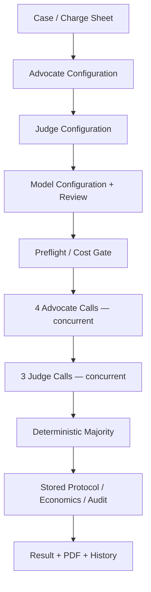
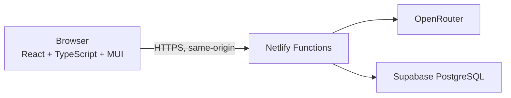

# ⚖️ The Tribunal

**An AI courtroom where disagreement is the point.** Four advocates argue, three judges independently decide, and a deterministic rule — never an eighth model call — resolves the verdict.

The Tribunal is a cognified web application built for **Agentic Software Engineering (ASE-26)**: a submitted case is argued by 2 PRO (Defense) and 2 CON (Opposition) advocates, judged independently by 3 judges, and resolved by a deterministic majority — with every token, dollar, and second of the deliberation recorded and inspectable afterward.

**[🚀 Live Application](https://ase26-the-tribunal.netlify.app)** · **[📖 Full User Guide](docs/USER_GUIDE.md)** · **[🔎 Visual Inspect](docs/INSPECT.md)** · **[🏗️ Architecture](ARCHITECTURE.md)** · **[📋 Specification](SPEC.md)**


## 📑 Table of Contents

- [🎯 What Is The Tribunal?](#-what-is-the-tribunal)
- [✨ Key Features](#-key-features)
- [⚖️ How a Tribunal Works](#-how-a-tribunal-works)
- [🛡️ PRO vs CON](#-pro-vs-con)
- [🤖 Shared Model vs Separate Models](#-shared-model-vs-separate-models)
- [📦 Importing a Tribunal](#-importing-a-tribunal)
- [🐺 Canonical Jon Snow Demo](#-canonical-jon-snow-demo)
- [📊 Economics & Auditability](#-economics--auditability)
- [📜 Results & Tribunal Protocol](#-results--tribunal-protocol)
- [🕘 Past Cases](#-past-cases)
- [🖼️ Screenshots](#-screenshots)
- [🏗️ Architecture](#-architecture)
- [🧰 Tech Stack](#-tech-stack)
- [🚀 Live Application](#-live-application)
- [💻 Local Installation](#-local-installation)
- [▶️ Running Locally](#-running-locally)
- [🧪 Verification](#-verification)
- [📖 User Guide](#-user-guide)
- [📚 Engineering Documentation](#-engineering-documentation)
- [⚠️ Important Notes / Known Limitations](#-important-notes--known-limitations)
- [🎓 Course Context](#-course-context)

## 🎯 What Is The Tribunal?

A single AI answer hides disagreement. The Tribunal exposes it: a user submits a disputed case (a **Charge Sheet**), configures seven AI participants, and watches how differently-configured advocates argue and how independent judges rule — with the full token and dollar cost of that deliberation shown alongside the result.

The Tribunal is **cognified software**, not an ordinary CRUD app: model calls perform the actual argumentation and judgement, not just a development-time convenience. That AI work is deliberately bounded — deterministic application code does everything else:

| Handled by AI models | Handled by deterministic code |
|---|---|
| Constructing advocate arguments | Form/file validation |
| Interpreting participant personalities | Persistence, routing |
| Producing judge verdicts and reasoning | **Majority calculation** |
| | Token/cost arithmetic |
| | Protocol assembly |

The majority verdict and the full protocol are **never** the product of an eighth model call — they are computed by ordinary code from the seven real outputs.

The Tribunal is educational and demonstrative. **It has no legal authority and does not provide legal advice.**

## ✨ Key Features

- ⚖️ **4 advocates + 3 judges** — 2 PRO (Defense), 2 CON (Opposition), 3 independent judges
- 🔀 **Shared Model** and **Separate Models** execution modes
- 🎭 Independently configurable **participant personalities**
- 🌐 **OpenRouter** model gateway — free and low-cost models preferred
- 📄 **Structured Tribunal Package import** — one file populates the whole setup
- 🧠 **Smart Import** — free-form dossier extraction via one setup-time model call
- 💾 **Persistent cases and runs**, with **Past Cases** for later reopening
- 💰 Full **token/cost tracking** with a hard per-run spend ceiling
- 🧾 **Deterministic majority** and **deterministic protocol assembly**
- 📥 **PDF Tribunal report** export
- 🐺 **Canonical Jon Snow demo** — a fixed, operator-funded showcase case
- 📱 Responsive **Ivory & Iron** UI with reduced-motion support

Ordinary model calls in this system are never relabeled as "agents" — see [Course Context](#-course-context).

## ⚖️ How a Tribunal Works



A successful run with no retries executes **exactly 7 logical model calls**: 4 advocates run concurrently, then — only once every advocate speech is validated — the 3 judges run concurrently. Majority and protocol are computed afterward with zero additional model calls.

## 🛡️ PRO vs CON

This mapping is locked and is not inferred from wording:

| Seat | Meaning | Argues toward |
|---|---|---|
| **PRO** | The defendant's **Defense** | `NOT_GUILTY` |
| **CON** | The **Opposition / Prosecution** | `GUILTY` |

The anchor is the defendant and the final verdict — never the surface spelling of "PRO"/"CON" and never the literal wording of the case's Exact Question.

## 🤖 Shared Model vs Separate Models

| | Shared Model | Separate Models |
|---|---|---|
| Model selection | One model for all seven seats | One model **per seat**, chosen independently |
| Distinctiveness | Role, side, and personality still differ per seat | Same, plus a different model per seat |
| Where it's set | One selector on Advocates/Judges/Review | A selector on each participant card |

Model assignment and personality are independent ideas: switching modes never touches the personalities already entered.

## 📦 Importing a Tribunal

A case can be built four ways, and **none of them ever automatically start a Tribunal**:

1. **Manual entry** — type the Defendant, Act, and Exact Question directly.
2. **Charge Sheet import** (`.txt` / `.md`) — fills only the three case fields.
3. **Full Tribunal Package import** (`.txt` / `.md`) — a strict file format that fills the case *and* all seven participant personalities in one step.
4. **Smart Import** — upload or paste a free-form dossier (`.txt` / `.md` / `.pdf`). A setup-time model call extracts the case and all seven participants for your review.

Smart Import specifically: it runs on **your own OpenRouter credential** (never the operator's), shows a zero-cost quote/preflight before anything is charged, requires an explicit **Confirm & Extract**, and lands on an editable Extraction Review screen — nothing is applied to your active setup until you press **Apply extracted draft**. Full step-by-step detail is in the [User Guide](docs/USER_GUIDE.md#7-smart-import).

## 🐺 Canonical Jon Snow Demo

A fixed, deterministic showcase case — *The Realm v. Jon Snow* — with a canonical seven-seat cast (2 named PRO advocates, 2 named CON advocates, 3 named judges) drawn from a course case-design dossier.

This one surface is a narrow, deliberate exception to how the rest of the product works: it is **operator-funded**, not paid for by a visitor's own OpenRouter key, and capped at a strictly lower cost ceiling than a generic run. The case, seats, and personalities are always visible and reviewable; **running it** additionally requires a lecturer/demo access capability carried in a prepared link. A successful run lands on the exact same generic result page every other Tribunal run uses.

## 📊 Economics & Auditability

Every run exposes what it actually cost, before and after it runs:

- A **conservative cost estimate** is shown before you convene, against a hard **$5.00** ceiling.
- Each completed attempt records its model, input/output tokens, latency, and actual provider cost.
- Retries are included in every total — nothing is "outside" the run budget.
- Unavailable telemetry is shown as `Unavailable`, never fabricated as `$0`.
- Majority and protocol assembly cost **zero** additional model calls.
- Every historical run remains inspectable later, using its original stored pricing snapshot — not today's price.

Full formulas and policy: [`docs/economics.md`](docs/economics.md).

## 📜 Results & Tribunal Protocol

The result page always leads with the answer, then the evidence:

1. **Majority verdict** — `GUILTY` or `NOT_GUILTY`, clearly labeled as a deterministic rule over the three votes, not a fourth opinion.
2. **All three judge votes**, shown together.
3. **Judicial reasoning** and **advocate arguments**, each expandable.
4. **Economics and audit detail**, down to the per-attempt pricing snapshot.
5. **The full deterministic protocol.**
6. A one-click **PDF Tribunal Report** export.

## 🕘 Past Cases

Every submitted case is persisted and can be reopened later from **Past Cases** — its Charge Sheet, its associated runs, and (for a completed run) its full stored result, protocol, and economics. Reopening a historical result **never** re-runs any model.

## 🖼️ Screenshots

<table>
<tr>
<td width="50%"><br/><sub>New Tribunal — Charge Sheet</sub></td>
<td width="50%"><br/><sub>Canonical Jon Snow Demo</sub></td>
</tr>
<tr>
<td width="50%"><br/><sub>Verdict &amp; Judge Votes</sub></td>
<td width="50%"><br/><sub>Economics &amp; Audit Detail</sub></td>
</tr>
</table>

More screens — Smart Import, Past Cases, Case Detail, the full Result page, and the Protocol/PDF controls — are in the [User Guide](docs/USER_GUIDE.md).

## 🏗️ Architecture



The browser never receives the operator's OpenRouter credential or a privileged database credential. For user-funded actions, the visitor's own OpenRouter key is stored only in that browser tab's session storage and attached only to completion-capable requests. It is never persisted to the application's database. Full detail, including the background-execution and budget-guard design: [`ARCHITECTURE.md`](ARCHITECTURE.md).

## 🧰 Tech Stack

| Layer | Technology |
|---|---|
| Frontend | React 19, TypeScript, Vite, Material UI |
| Routing | React Router |
| Validation | Zod |
| Backend | Netlify Functions (sync + Background Function) |
| Database | Supabase PostgreSQL |
| Model gateway | OpenRouter |
| Money math | decimal.js |
| PDF export | @react-pdf/renderer |
| PDF text extraction (Smart Import) | pdfjs-dist |
| Testing | Vitest, Testing Library |
| Linting/types | ESLint, TypeScript |

## 🚀 Live Application

```text
https://ase26-the-tribunal.netlify.app
```

This is a **shared, single-tenant public course demo**. Submitted cases and runs may be retained and visible in shared history — there is no private per-user storage. **Do not submit sensitive, private, confidential, or identifying information.** See the [User Guide](docs/USER_GUIDE.md#23-privacy--public-demo) for the full disclosure.

## 💻 Local Installation

**Prerequisites:** Node.js `24.x`, npm `>=10`.

```bash
git clone https://github.com/Shlomi-Hazan/ase26-the-tribunal.git
cd ase26-the-tribunal
npm install
cp .env.example .env
```

`.env.example` contains **empty placeholders only** — never real credentials. It documents the names of the server-side environment variables a full local backend needs (Supabase connection, OpenRouter operator metadata key, and the internal/demo secrets described in [`SECURITY.md`](SECURITY.md)); populate your own values there, never commit real ones.

## ▶️ Running Locally

```bash
npm run dev
```

Starts the Vite frontend alone — useful for UI-only work, but API calls will fail with no backend behind them.

```bash
npm run dev:netlify
```

Runs the frontend **and** the Netlify Functions together, matching production request routing. Use this for anything that touches the backend. Once running, `GET /api/health` should return `{"status":"ok","service":"the-tribunal"}`.

## 🧪 Verification

```bash
npm run verify
```

Runs the full mechanical gate in one command: `lint` → `typecheck` → `test` → `build` → client-bundle secret-boundary check → Netlify Functions packaging check.

At final course closeout (Milestone 16), this passed at **74 test files / 1111 tests** — historical evidence, not a permanent guarantee of the current count.

## 📖 User Guide

**[📖 The Tribunal — User Guide](docs/USER_GUIDE.md)** — a complete, screenshot-illustrated walkthrough for end users: every screen, every control, cost and privacy warnings, and an FAQ.

## 📚 Engineering Documentation

**Product / Requirements**
- [Intent](INTENT.md) — product purpose and durable direction
- [Specification](SPEC.md) — required, testable behavior
- [UI Specification](docs/ui-spec.md) — interaction and presentation contract

**Architecture / Security / Economics**
- [Architecture](ARCHITECTURE.md) — approved technical structure
- [Security](SECURITY.md) — threat model and security checklist
- [Economics](docs/economics.md) — cost/token/pricing formulas and policy
- [Architecture Decision Records](docs/adr/) — detailed per-milestone planning decisions

**Process / Audit**
- [Roadmap](ROADMAP.md) — milestone sequencing and closeout records
- [Agent Contract](AGENTS.md) — standing rules for coding agents
- [Claude Code Guidance](CLAUDE.md) — Claude-specific entry point
- [M16 Final Verification Evidence Index](docs/verification/m16-final-audit.md) — pointer into the project's Git/Issue/PR/CI audit trail

## ⚠️ Important Notes / Known Limitations

- **Educational demo — not legal advice.** The Tribunal has no legal authority.
- **V1 has no user accounts.** There is no login and no private per-user ownership of data.
- **Do not submit sensitive, private, confidential, or identifying material.** Submitted cases may be visible in shared demo history.
- This is a **public, shared demo** — see [`SECURITY.md`](SECURITY.md) and [`SPEC.md`](SPEC.md) for the full model.

## 🎓 Course Context

Built for **Agentic Software Engineering (ASE-26)**. The project intentionally demonstrates: problem framing before implementation, explicit specification, browser/backend/database/deployment separation, cognified runtime behavior, cost and latency awareness, context engineering, version control, verification before trust, auditability, appropriate multi-model orchestration, and an explicit model-versus-agent boundary.

A genuinely agentic execution mode was considered and **cancelled** for this project — see [`INTENT.md`](INTENT.md#8-execution-configurations) and [`ROADMAP.md`](ROADMAP.md) Milestone 12. The Tribunal does not implement "agents"; it implements seven ordinary, clearly-bounded model calls.
