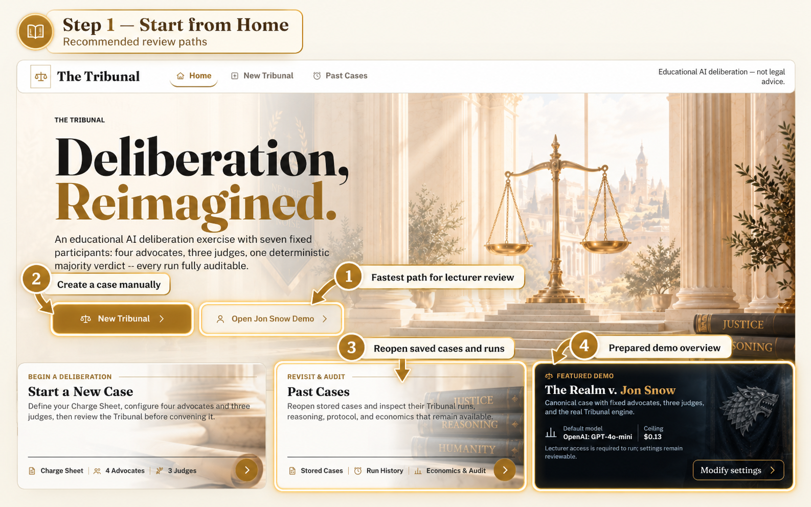
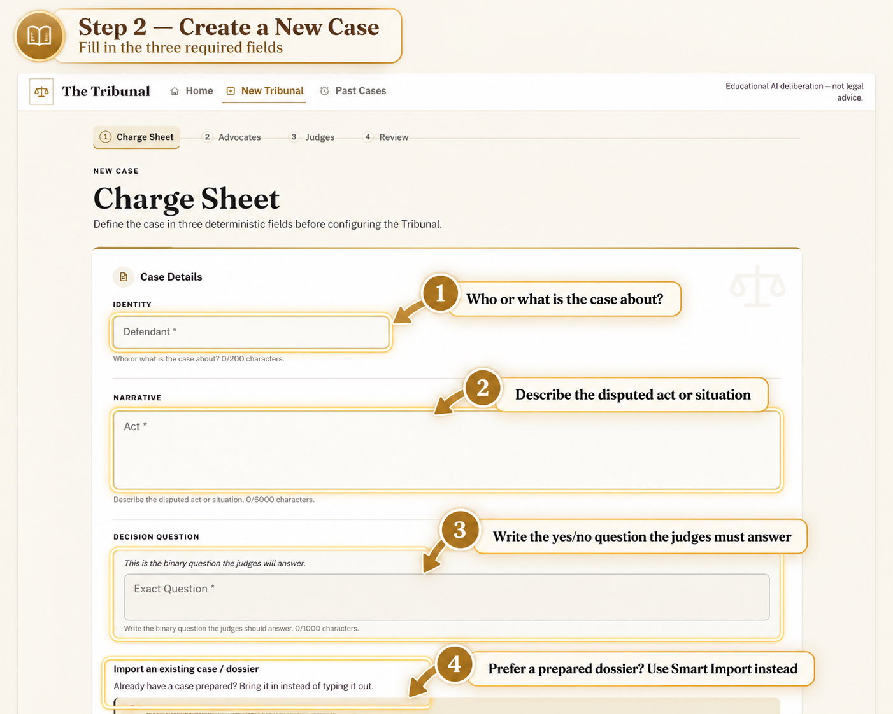
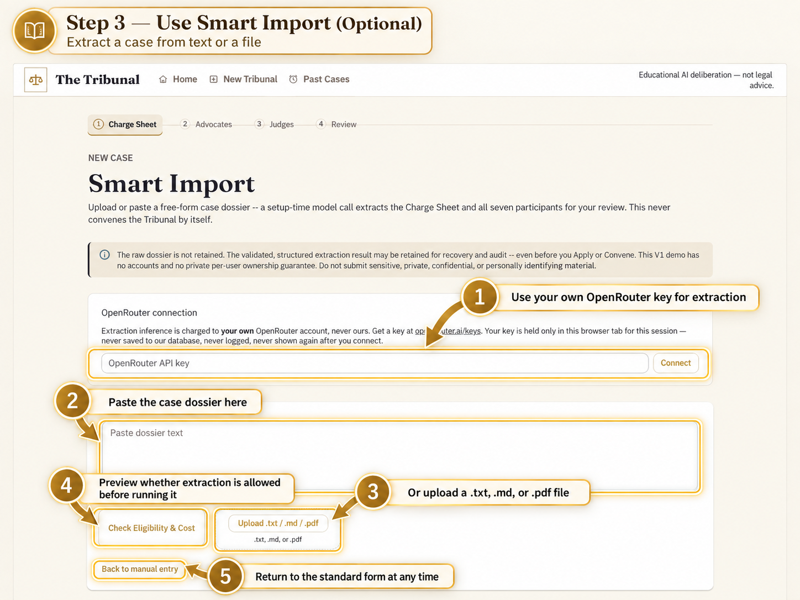
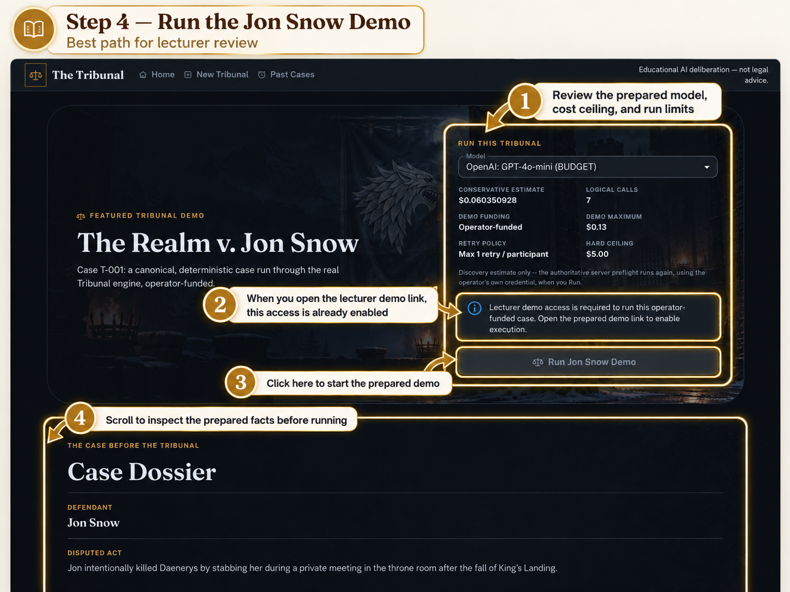
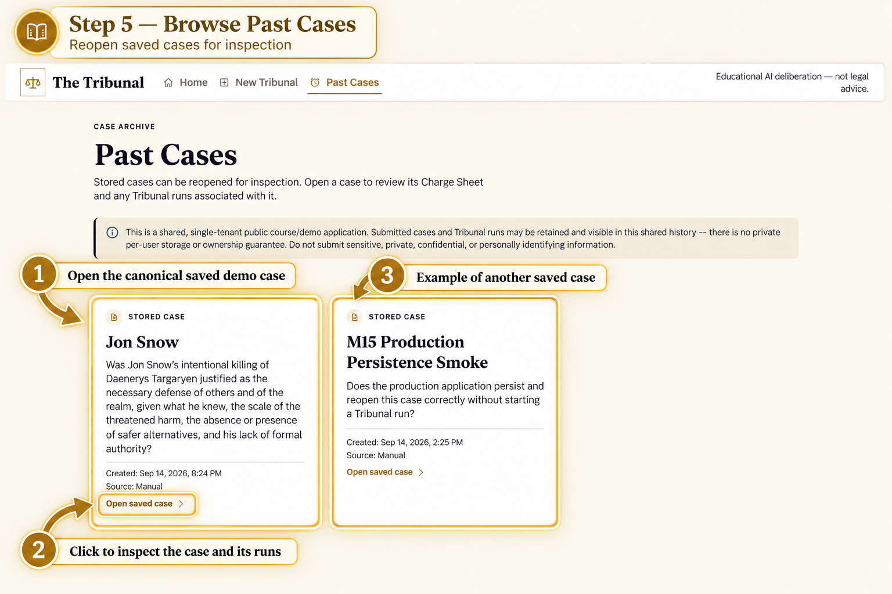
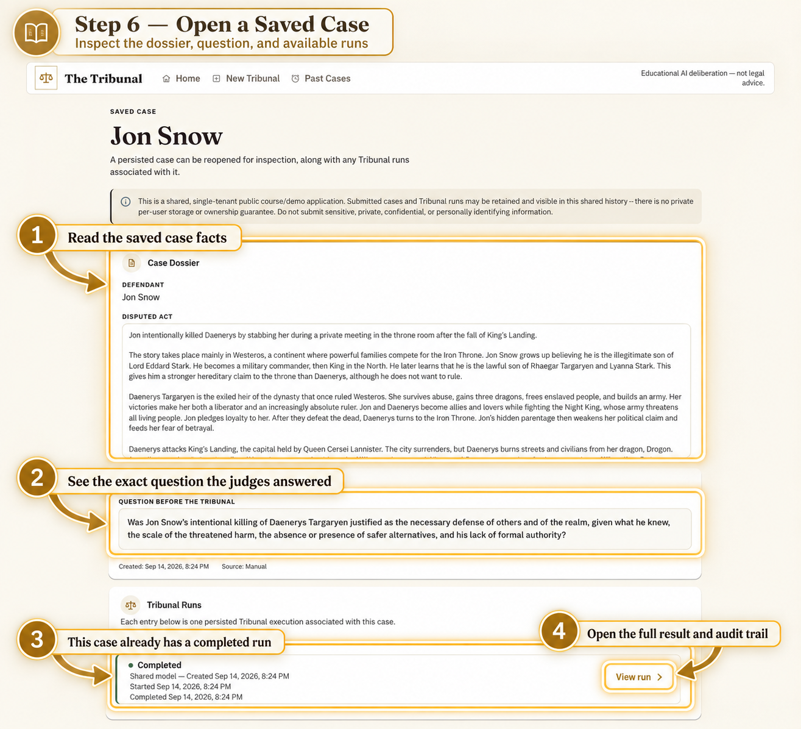
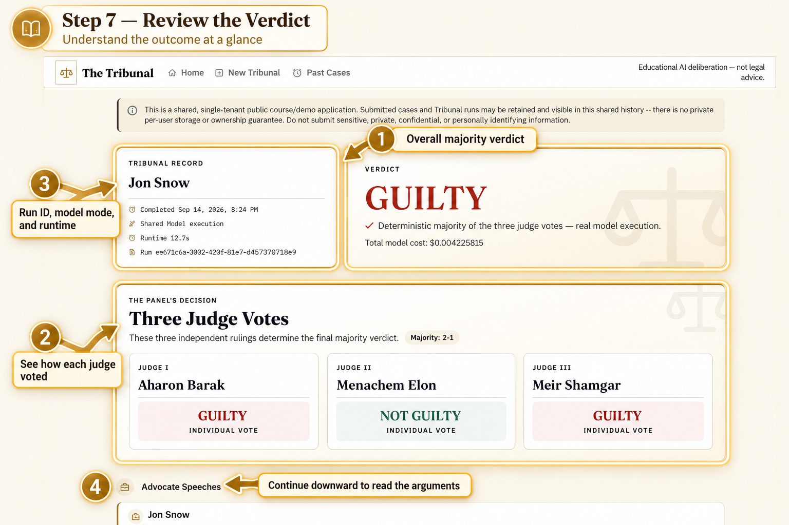
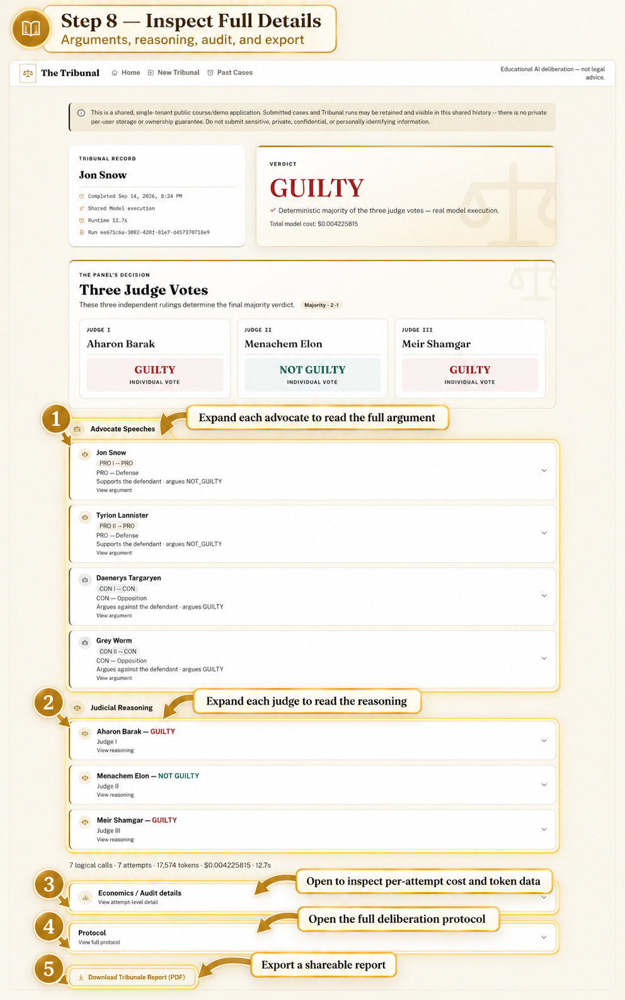
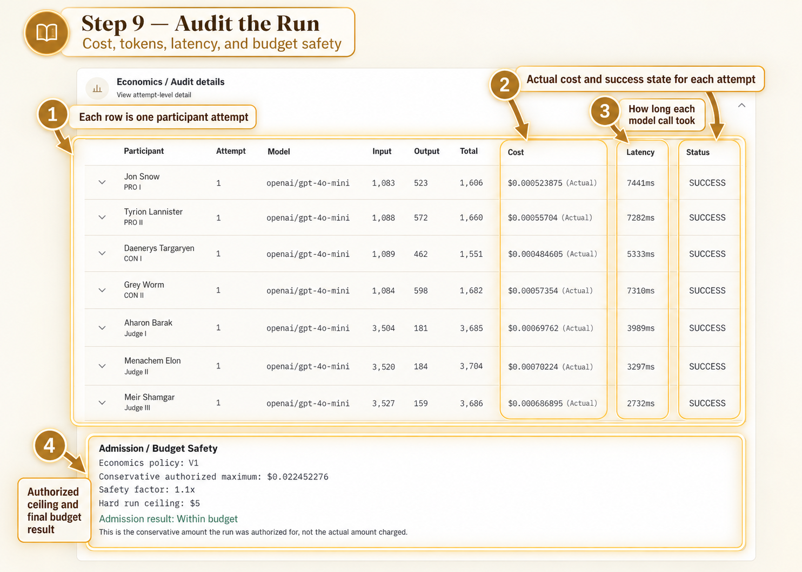

# 🔎 The Tribunal — Visual Inspect

### A quick visual walkthrough for reviewers

This page provides a **fast, visual inspection path** through the main flows of **The Tribunal**.  
It is designed for reviewers who want to understand the application quickly before diving into the full documentation.

For complete details, see the main [README](../README.md) and the [User Guide](./USER_GUIDE.md).

---

## 🏠 Step 1 — Start from Home

---

## ⚖️ Step 2 — Create a New Case

---

## ✨ Step 3 — Use Smart Import

---

## 🐺 Step 4 — Run the Jon Snow Demo

---

## 🗂️ Step 5 — Browse Past Cases

---

## 📂 Step 6 — Open a Saved Case

---

## 🧑‍⚖️ Step 7 — Review the Verdict

---

## 🧾 Step 8 — Inspect Full Details

---

## 📊 Step 9 — Audit the Run

---

**The Tribunal** · Visual inspection guide

