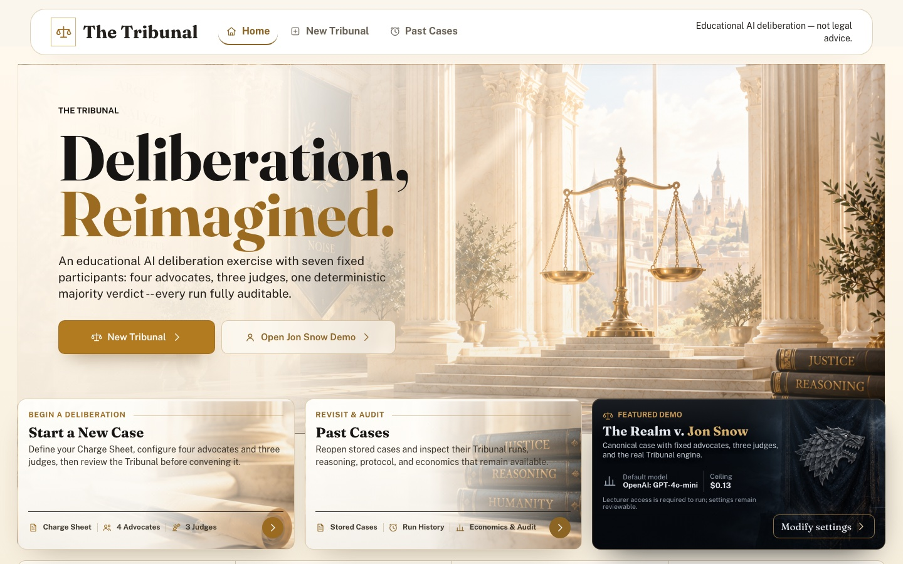
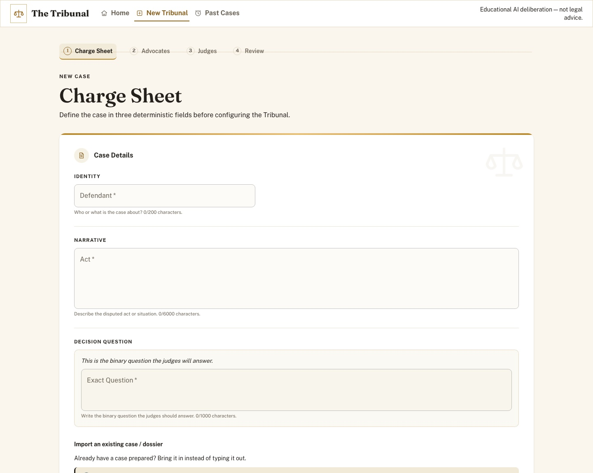
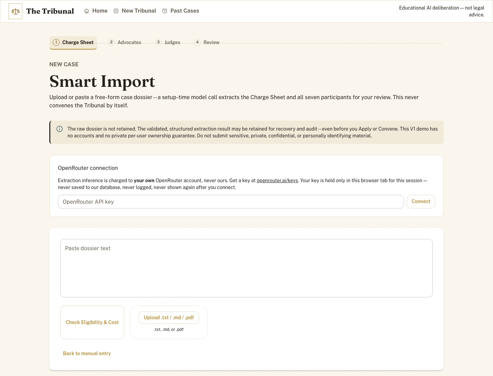
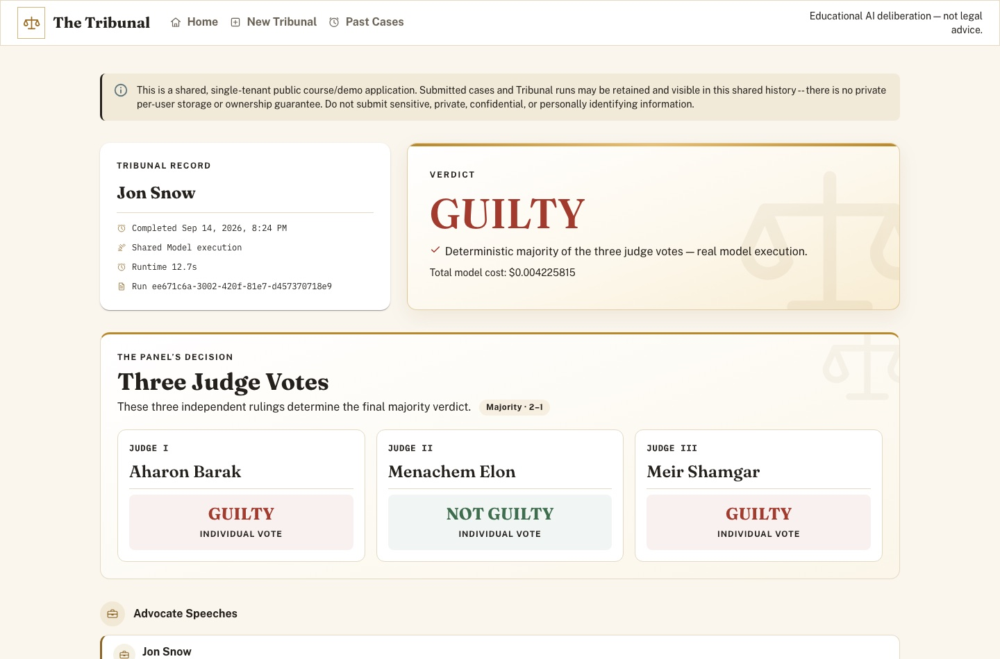
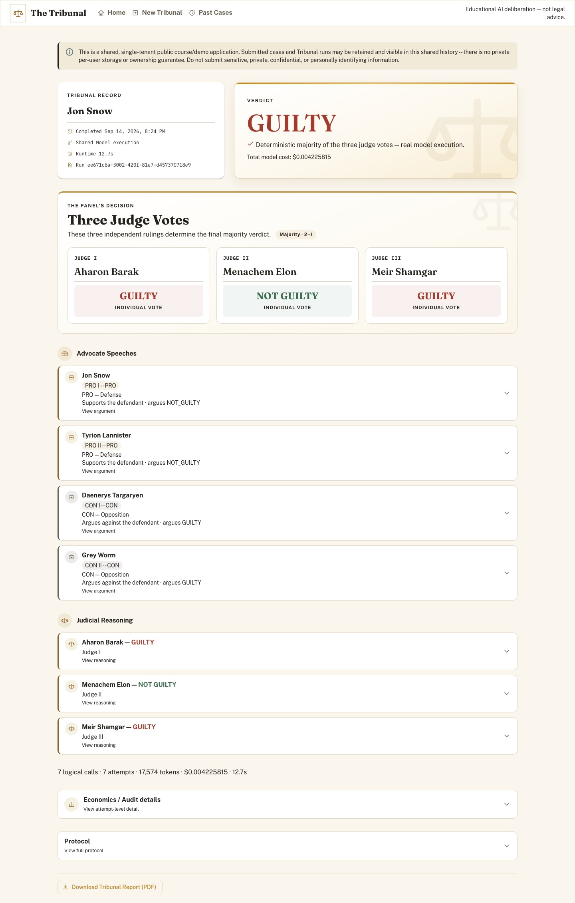
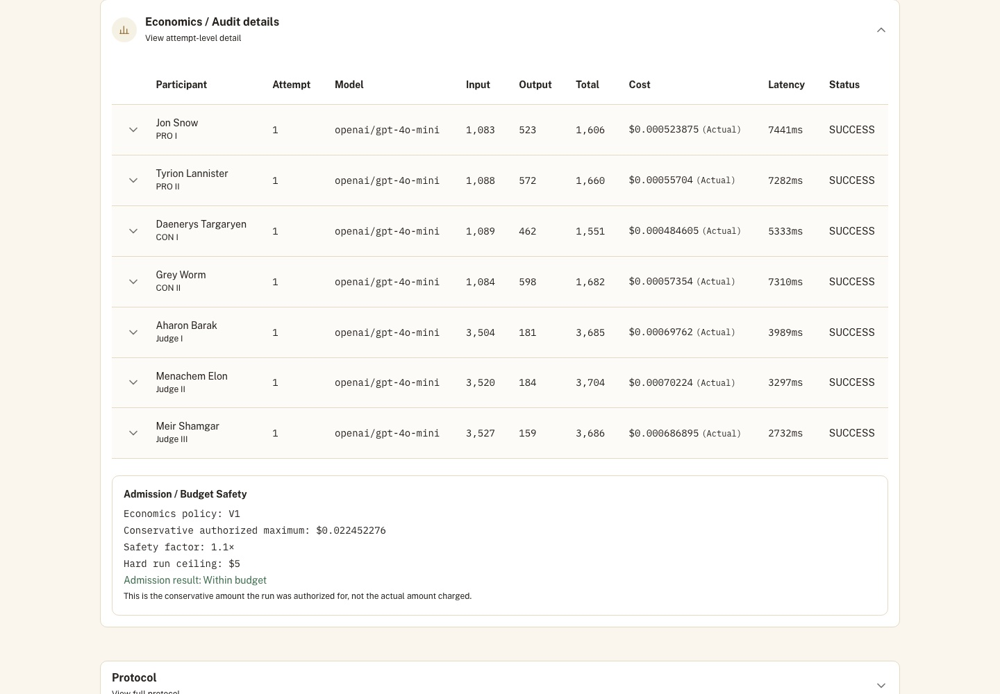
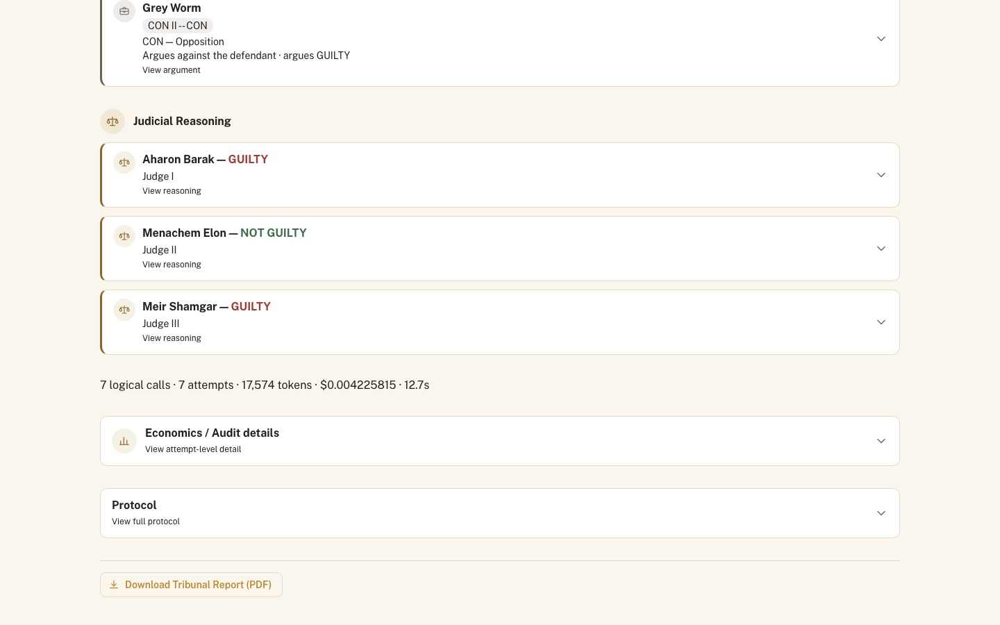
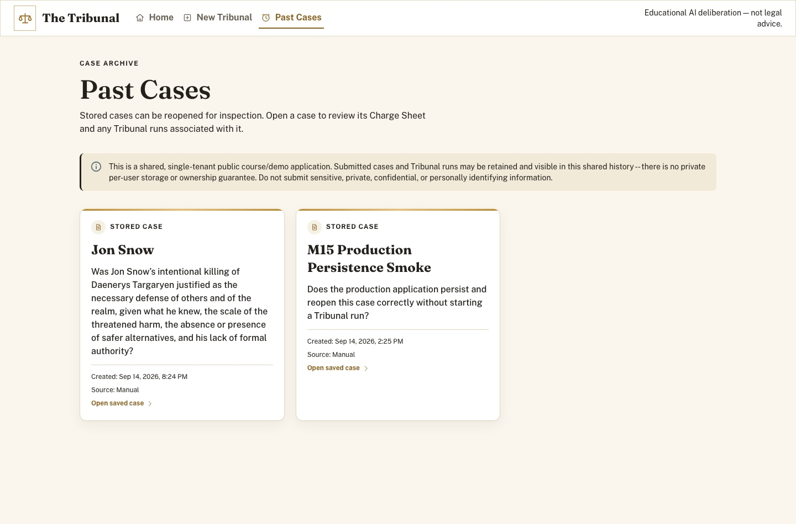
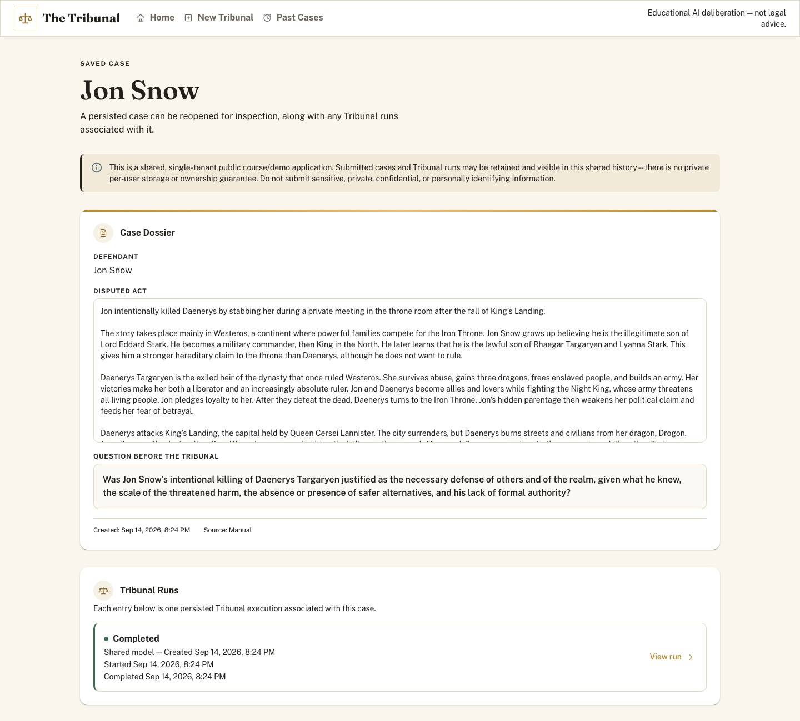
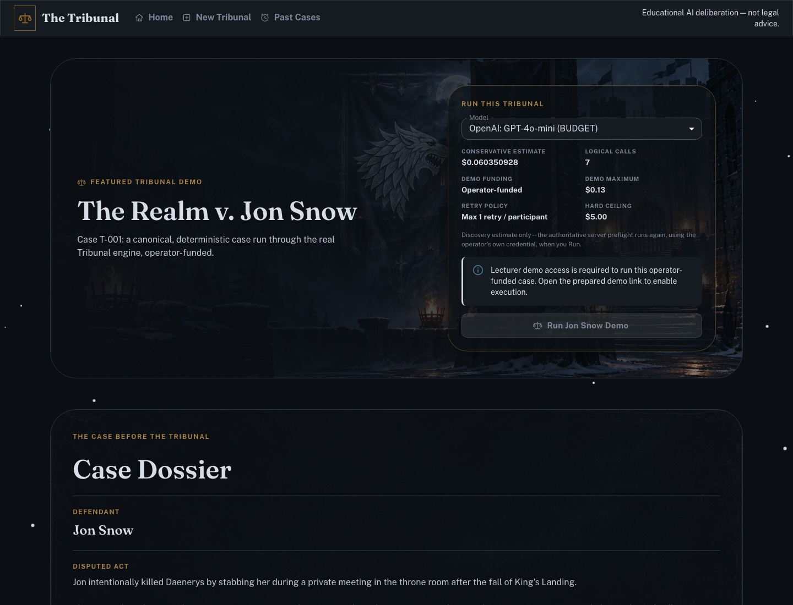

# 📖 The Tribunal — User Guide

A complete, step-by-step guide to using The Tribunal at **[ase26-the-tribunal.netlify.app](https://ase26-the-tribunal.netlify.app)**. This guide is written for people *using* the product — for the engineering story behind it, see the [README](../README.md) and [Specification](../SPEC.md).

> ⚠️ **Public demo notice.** This is a shared, single-tenant course demo. There are no user accounts. Cases and runs you submit may be visible to other visitors in shared history. **Never submit sensitive, private, confidential, or personally identifying material.** See [§23](#23-privacy--public-demo).

## Table of Contents

1. [Introduction](#1-introduction)
2. [Quick Start](#2-quick-start)
3. [Home Page](#3-home-page)
4. [Creating a New Tribunal](#4-creating-a-new-tribunal)
5. [Charge Sheet](#5-charge-sheet)
6. [Import Options](#6-import-options)
7. [Smart Import](#7-smart-import)
8. [Advocates](#8-advocates)
9. [Judges](#9-judges)
10. [Shared vs Separate Models](#10-shared-vs-separate-models)
11. [Connecting OpenRouter](#11-connecting-openrouter)
12. [Review Screen & Cost Estimate](#12-review-screen--cost-estimate)
13. [Convene Tribunal](#13-convene-tribunal)
14. [Deliberation](#14-deliberation)
15. [Results](#15-results)
16. [Economics, Tokens & Attempts](#16-economics-tokens--attempts)
17. [Tribunal Protocol](#17-tribunal-protocol)
18. [PDF Export](#18-pdf-export)
19. [Past Cases](#19-past-cases)
20. [Case Details & Historical Runs](#20-case-details--historical-runs)
21. [Jon Snow Demo](#21-jon-snow-demo)
22. [Errors, Retry & Recovery](#22-errors-retry--recovery)
23. [Privacy & Public Demo](#23-privacy--public-demo)
24. [FAQ](#24-faq)

## 1. Introduction

The Tribunal lets you submit a disputed case and watch it argued and judged by AI participants with a fixed, transparent structure: **2 PRO (Defense) advocates**, **2 CON (Opposition) advocates**, and **3 independent judges**. A deterministic rule — not another model call — combines the three verdicts into one majority result, and every token and dollar the deliberation used is recorded alongside it.

**What this means:** you are not chatting with one AI. You are configuring seven distinct participants, each with its own role and personality, and watching them disagree, argue, and rule independently.

This is an educational demo. **It has no legal authority and is not legal advice.**

## 2. Quick Start

The fastest path to a result:

1. Open the [live application](https://ase26-the-tribunal.netlify.app).
2. Click **New Tribunal**.
3. Fill in the three Charge Sheet fields, or use an import option (§6).
4. Click through Advocates → Judges, adding a personality for each seat (or leave the defaults where offered).
5. On Review, connect an OpenRouter key (§11) and click **Convene Tribunal**.
6. Watch the Deliberation screen, then read the Result.

Prefer to see a finished example first without spending anything? Open the [Jon Snow Demo](#21-jon-snow-demo) settings page from Home — every seat and personality is visible with no cost or credential required to *view* it.

## 3. Home Page



| Control | What it does | When to use it |
|---|---|---|
| **New Tribunal** (hero button) | Goes to the Charge Sheet screen | Starting a fresh case |
| **Open Jon Snow Demo** (hero button) | Goes to the Jon Snow demo settings page | Exploring a finished example |
| **Start a New Case** (card) | Same destination as *New Tribunal* | Alternative entry point, same action |
| **Past Cases** (card) | Goes to the case archive | Reopening a case you (or someone else) already submitted |
| **The Realm v. Jon Snow** (card) | Goes to the Jon Snow demo settings page | Same as *Open Jon Snow Demo* |

## 4. Creating a New Tribunal

Clicking **New Tribunal** starts a four-step setup flow, tracked by a stepper at the top of every setup screen:

`① Charge Sheet → ② Advocates → ③ Judges → ④ Review`

You can navigate back at any point before convening. Manual entry and the structured import methods (§6) never call a model — free navigation all the way through. Smart Import (§7) is the one exception, with its own billed step. **Convene Tribunal** on the Review screen is the cost-bearing action that starts the real Tribunal run itself.

## 5. Charge Sheet



A Charge Sheet has exactly three fields:

| Field | What it means | Limit |
|---|---|---|
| **Defendant** | Who or what the case is about | 1–200 characters |
| **Act** | The disputed act or situation | 1–6,000 characters |
| **Exact Question** | The binary question the judges will answer | 1–1,000 characters |

| Control | What it does |
|---|---|
| **Continue to Advocates** | Validates all three fields and moves to the next step; disabled/blocked until every field is valid |
| **Import Charge Sheet** | Uploads a `.txt`/`.md` file and fills only these three fields |
| **Import Full Tribunal Package** | Uploads a `.txt`/`.md` file and fills the case *and* all seven participant personalities |
| **Smart Import (free-form dossier)** | Goes to the Smart Import screen (§7) |

## 6. Import Options

| Method | Fills | Format | Model call? |
|---|---|---|---|
| Manual entry | Case fields only | — | No |
| Charge Sheet import | Case fields only | `.txt` / `.md`, strict markers | No |
| Full Tribunal Package import | Case + all 7 personalities | `.txt` / `.md`, strict structure | No |
| Smart Import | Case + all 7 personalities | Free-form `.txt` / `.md` / `.pdf` | **Yes — one setup-time call** |

**No import method ever automatically convenes a Tribunal.** Every import lands you back in the setup flow for review before anything runs.

## 7. Smart Import



Smart Import turns a free-form dossier — not structured with markers — into a complete draft, using one model call to extract the case and all seven participants.

**Step by step:**

1. **Connect OpenRouter** (§11) — extraction is billed to *your* account, never the operator's. This step can wait until just before you extract.
2. **Provide the dossier** — paste text, or click **Upload .txt / .md / .pdf**.
3. Click **Check Eligibility & Cost** — a free, read-only quote. No credential is required for this step and no cost is incurred.
4. Review the quote (estimated maximum cost, configured model, per-attempt maximum) and click **Confirm & Extract** — this is the point where a real, billed model call happens, charged to your connected account.
5. **Extraction Review** — every field is editable. Fields the model could not resolve are highlighted. Nothing here has touched your active setup yet.
6. Click **Apply extracted draft** to send the reviewed content into the normal setup flow, or **Cancel** to discard it and keep whatever draft you had before.

| Control | What it does | Notes |
|---|---|---|
| **Check Eligibility & Cost** | Free preflight quote | Zero cost, no credential required |
| **Confirm & Extract** | Runs the real extraction | 💰 This is the billed step — requires a connected OpenRouter key |
| **Retry** | Retries a failed extraction | Only offered when the failure is retryable; at most one retry per extraction |
| **Recover** / **Check Status** | Safely replays the exact same request | Shown when a connection was lost before a response arrived — never starts a new, separately-charged attempt |
| **Apply extracted draft** | Sends the reviewed content to setup Review | Nothing is applied until you click this |
| **Cancel** | Discards the extraction | Your prior active draft is untouched |

⚠️ **Cost note:** *Confirm & Extract*, *Retry*, and *Recover* can each trigger a real, billed OpenRouter call against your connected account. *Check Eligibility & Cost* never does.

The raw dossier you upload is **not retained** after extraction. The validated, structured result *may* be retained (for recovery and audit) even before you apply it — this demo has no accounts and no private-ownership guarantee for that retained result either.

## 8. Advocates

Two PRO (Defense) and two CON (Opposition) seats, each independently configurable:

| Control | What it does |
|---|---|
| Personality field (per seat) | Manual text, or file upload, giving that advocate its behavioral context |
| Model selector (per seat) | Only visible in **Separate Models** mode |
| **Back** | Returns to the Charge Sheet |
| **Continue to Judges** | Validates all four personalities and moves on |

Every advocate always receives the same Charge Sheet and produces exactly one speech for its assigned side — the side itself can never be changed by personality text.

## 9. Judges

Three judge seats, same personality/model controls as Advocates:

| Control | What it does |
|---|---|
| **Back** | Returns to Advocates |
| **Review Tribunal** | Validates all three personalities and moves to Review |

Every judge receives the Charge Sheet **and all four validated advocate speeches** before producing its own independent verdict and reasoning.

## 10. Shared vs Separate Models

Set once, on the Advocates screen (it applies to the whole run):

| | Shared Model | Separate Models |
|---|---|---|
| What you pick | One model for all seven seats | One model **per seat** |
| Where | One selector | A selector on each participant card |
| Personalities | Unaffected either way | Unaffected either way |

Switching from Separate back to Shared does not silently pick an expensive model for you — you choose the shared model explicitly.

## 11. Connecting OpenRouter

Normal Tribunal runs (Convene) and Smart Import's extraction are **billed to your own OpenRouter account**. The one documented exception is the canonical Jon Snow demo, which is operator-funded — see [§21](#21-jon-snow-demo).

| Control | What it does |
|---|---|
| **OpenRouter API key** field | Paste your key here |
| **Connect** | Stores the key in this browser tab only, for this session |
| **Disconnect** | Clears it immediately |

Your key is **never** sent anywhere except as a header on the specific request that needs it, never logged, and never saved to any database. The full key is never shown again once connected — a connected indicator may display only its last 4 characters, masked. Get a key at [openrouter.ai/keys](https://openrouter.ai/keys).

## 12. Review Screen & Cost Estimate

Review is the last screen before anything is charged. It shows, read-only:

- The full **Case Docket** (Defendant / Act / Exact Question).
- The complete seven-seat roster, grouped PRO — CON — Judges.
- **Economics & Preflight**: expected logical calls (always 7), the retry policy (max one retry per seat), the **$5.00 hard ceiling**, and — once a model is selected — a conservative maximum cost estimate for this exact configuration.
- The **OpenRouter Connection** panel (§11).

> The number shown here is a **conservative safety bound**, not an exact charge. The real, authoritative check runs again — using your connected credential — the moment you press Convene.

| Control | What it does |
|---|---|
| **Edit Charge Sheet / Advocates / Judges** | Shown only while the configuration is invalid; jumps to the screen that needs fixing |
| **Save Case** | Persists just the case (not the full run configuration) to Past Cases |
| **Back** | Returns to Judges |
| **Convene Tribunal** | Freezes the configuration and starts the real run — 💰 this is the cost-bearing action |

## 13. Convene Tribunal

Clicking **Convene Tribunal**:

1. Freezes the case and all seven participant configurations — they cannot change after this point.
2. Re-checks eligibility and cost using your connected credential (the authoritative check, not the estimate shown above).
3. If eligible, starts the real Tribunal execution and takes you to the live Deliberation/Result page.
4. If the conservative bound exceeds $5.00, the run is blocked before any model is called — see [§22](#22-errors-retry--recovery).

Double-clicking or refreshing does not create a second paid run — the button becomes disabled once a request is in flight.

## 14. Deliberation

While a run is in progress, the same page shows live status for every participant, grouped Advocates (PRO/CON) then The Bench, refreshing automatically:

| Status | Meaning |
|---|---|
| Waiting | Not started yet |
| Running | Currently in progress |
| Retrying | The one permitted retry is in use |
| Complete | Finished successfully |
| Failed | Terminally failed after its retry |

Judges do not begin until **all four** advocate speeches have validated — until then you'll see *"Judges begin only after all four advocate speeches validate."* If a run is taking unusually long, an honest "taking longer than expected" notice appears; this is never a fabricated failure or a silent retry.

You can safely refresh the page or navigate away and come back — the run continues on the server regardless.

## 15. Results



The result always leads with the answer:

1. **Verdict** — `GUILTY` or `NOT GUILTY`, explicitly labeled as the *deterministic majority of the three judge votes*, never a fourth opinion.
2. **Three Judge Votes**, shown together with the majority split (e.g. "Majority · 2–1").
3. **Advocate Speeches** — one expandable card per advocate; click a row to **View argument**.
4. **Judicial Reasoning** — one expandable card per judge; click a row to **View reasoning**.



A `FAILED` or `BLOCKED_BUDGET` run is shown as a clearly distinct state — never as a verdict — with any partial spend disclosed honestly.

## 16. Economics, Tokens & Attempts

Directly below the reasoning sections, a compact line summarizes the whole run — for example:

```text
7 logical calls · 7 attempts · 17,574 tokens · $0.004225815 · 12.7s
```

Click **Economics / Audit details** to expand the full per-attempt table:



| Column | Meaning |
|---|---|
| **Model** | Which model actually handled this participant's call |
| **Input / Output / Total** | Token counts for that one attempt |
| **Cost**, labeled **Actual** or **Derived** | The provider-billed amount when known; otherwise a computed comparison figure — always labeled which one it is |
| **Latency** | How long that attempt took |
| **Status** | `SUCCESS`, or the failure/retry state |

Expanding any row further reveals the historical pricing snapshot used for that attempt (never today's price), the conservative amount it was authorized for, and provider/audit metadata. Below the table, **Admission / Budget Safety** shows the conservative maximum the run was authorized for against the $5.00 hard ceiling — not the actual amount charged. A field that genuinely wasn't reported shows `Unavailable` — never a fabricated `$0`.

## 17. Tribunal Protocol

Click **Protocol → View full protocol** for the complete, deterministic record of the run: the frozen case and participant configuration, model/prompt versions, all speeches and verdicts, and the majority result — assembled entirely from stored data, with **zero** additional model calls.

## 18. PDF Export



**Download Tribunal Report (PDF)** generates a document from this exact completed run's own stored data, entirely in your browser — no network or model call is involved. If generation fails, you can simply try again.

## 19. Past Cases



Every case you save or convene is listed here, newest first. Click a card's **Open saved case** to reopen it.

## 20. Case Details & Historical Runs



Reopening a case shows its full Case Dossier and every Tribunal run associated with it, each labeled with its status and timestamps. Click **View run** to reopen a run's complete stored result — reopening **never** re-runs any model, regardless of how long ago the run completed.

## 21. Jon Snow Demo



A fixed showcase case — *The Realm v. Jon Snow* — with a canonical, non-editable cast: 2 named PRO advocates, 2 named CON advocates, 3 named judges, each with a full personality dossier visible on this page.

| Control | What it does | Requires |
|---|---|---|
| **Model** selector | Choose among the models currently eligible *and* within this demo's own lower cost ceiling | Nothing — always viewable |
| **Run Jon Snow Demo** | Starts a real run of this exact case | A lecturer/demo access capability, carried in a prepared link |

This surface is **operator-funded** — unlike every other Tribunal run, it is not charged to a visitor's own OpenRouter account, and there is no credential field on this page at all. Without the access capability, the button stays disabled with an explanation; the case, seats, and personalities remain fully visible either way. A successful run lands on the same generic result page (§15) every other run uses.

## 22. Errors, Retry & Recovery

| Situation | What you'll see | What it means |
|---|---|---|
| A field is invalid | Inline error text next to that field | Fix it before continuing — nothing is charged |
| `BLOCKED_BUDGET` | "This run cannot be executed" | The conservative estimate exceeded $5.00 — **no model was called** |
| An advocate or judge fails twice | "The Tribunal could not complete" | Failure is never shown as a verdict; any partial spend is disclosed |
| Smart Import: retryable failure | A **Retry** button | Up to one retry per extraction |
| Smart Import: ambiguous outcome | A **Recover** / **Check Status** button | Safely replays the exact same request — never double-charges |
| A run "takes longer than expected" | A calm informational notice | Not a failure; the run has not stopped |

## 23. Privacy & Public Demo

This is a **shared, single-tenant public demo application**:

- There are **no user accounts** and no login.
- Submitted cases and runs **may be retained and visible** to other visitors in shared history.
- There is **no private per-user storage or ownership guarantee**.
- **Do not submit sensitive, private, confidential, or personally identifying information** — in a Charge Sheet, a personality, or a Smart Import dossier.

See [`SECURITY.md`](../SECURITY.md) for the complete security and privacy model.

## 24. FAQ

**Does this cost me money?**
Browsing, manual setup, and preflight checks are always free. **Convene Tribunal** and **Confirm & Extract** are the two actions that bill your connected OpenRouter account, and both show a cost estimate first. Within Smart Import, **Retry** can also bill your account (it starts the one permitted second extraction attempt), and **Recover** / **Check Status** normally just replays or resumes the same attempt you already started — but if the server still needs to complete that attempt, that replay can itself be the call that gets billed. See [§7](#7-smart-import) for the full breakdown.

**Can I add a fourth advocate or a second judge panel?**
No — the seven seats (2 PRO, 2 CON, 3 judges) are fixed by design; this cannot be changed from the UI.

**Why can't I run the Jon Snow demo?**
Running it requires a lecturer/demo access capability carried in a prepared link. Without it, the case remains fully viewable but the Run button stays disabled.

**Will refreshing the page during deliberation cancel my run?**
No. Execution happens on the server; refreshing or navigating away and back simply resumes watching the same run.

**Is this real legal advice?**
No. The Tribunal is an educational demonstration with no legal authority of any kind.

**What happens to the case I submit?**
It's stored in shared demo history, reachable by anyone with the application's URL — see [§23](#23-privacy--public-demo).

---

Questions this guide doesn't answer? See the [README](../README.md), the [Specification](../SPEC.md), or open the [live application](https://ase26-the-tribunal.netlify.app) and explore. Browsing, manual setup, structured imports, and cost/eligibility preflight are free. Any action capable of invoking a model is explicitly identified in this guide before you use it.
